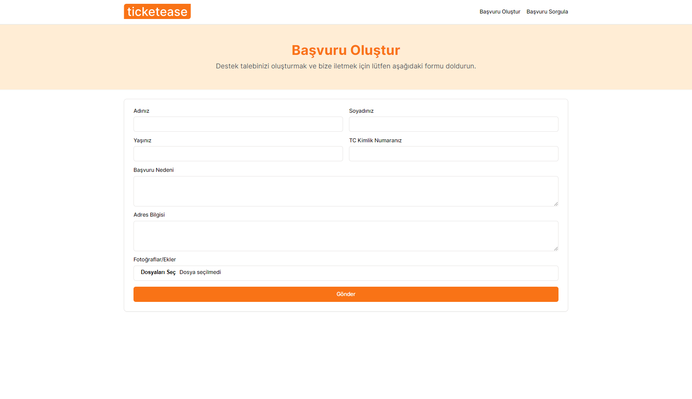
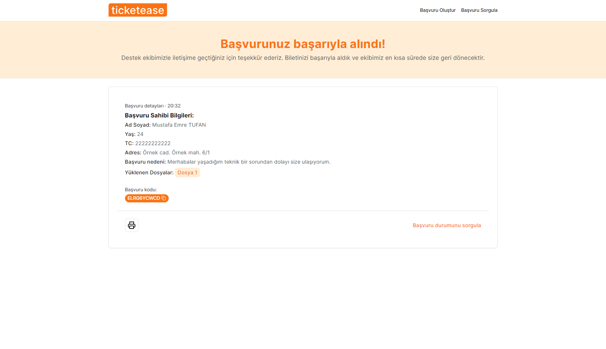
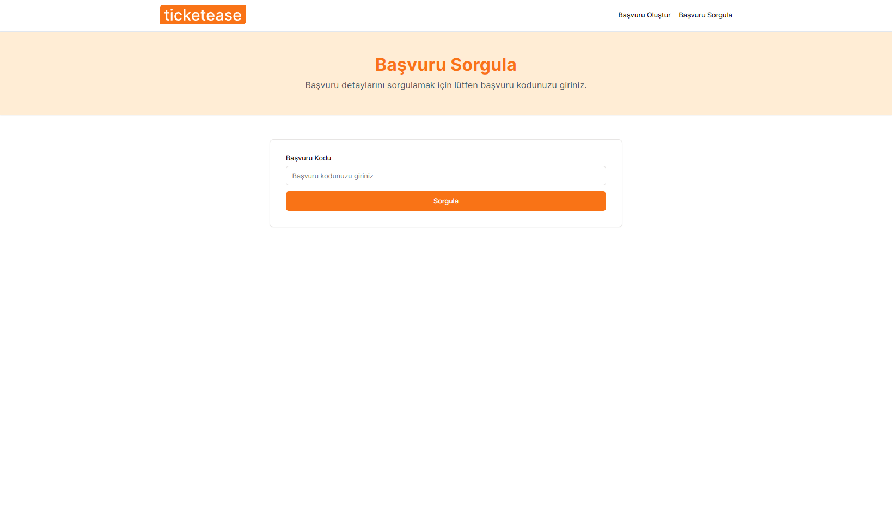
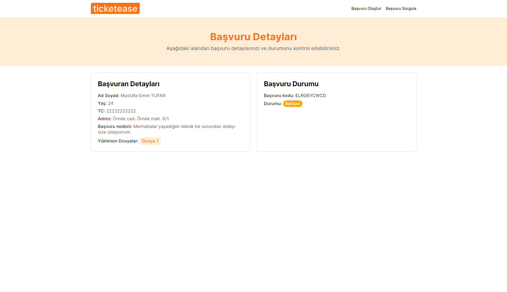
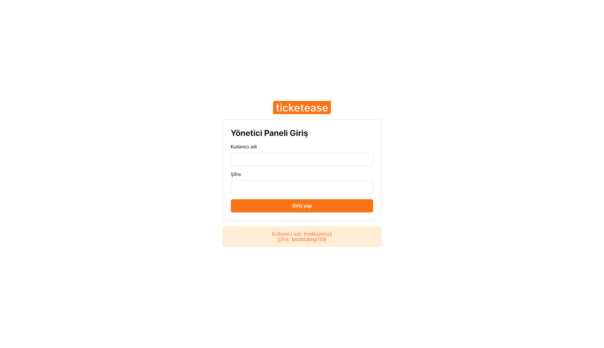
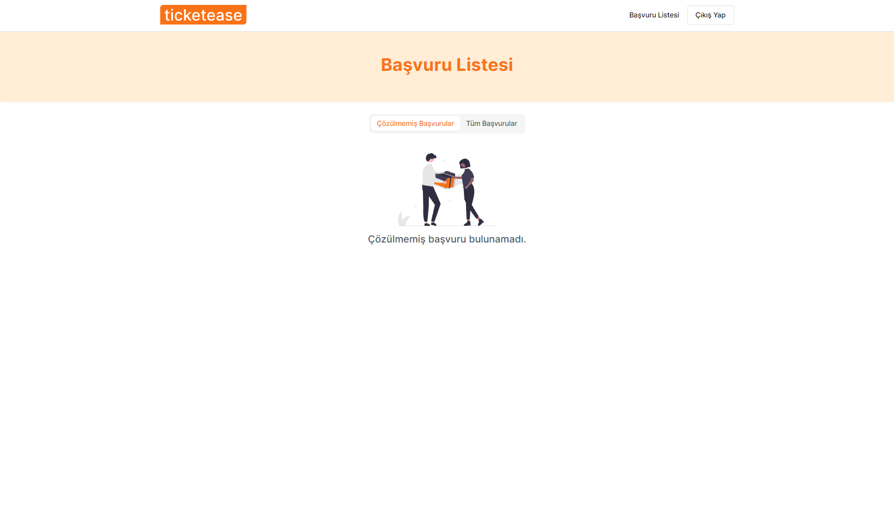
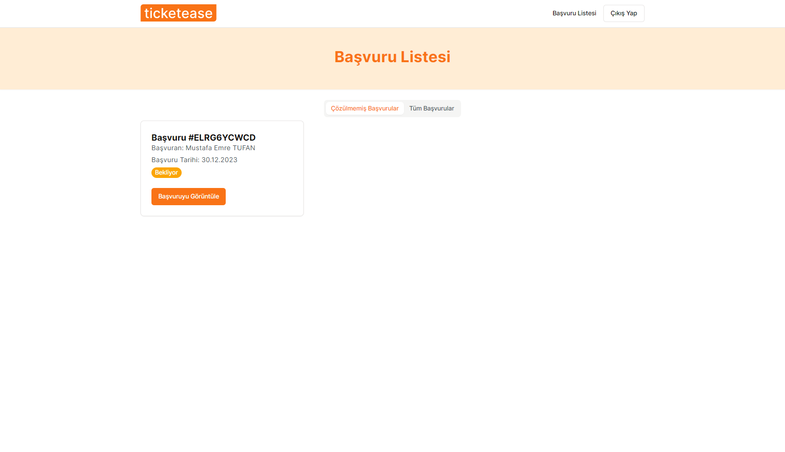
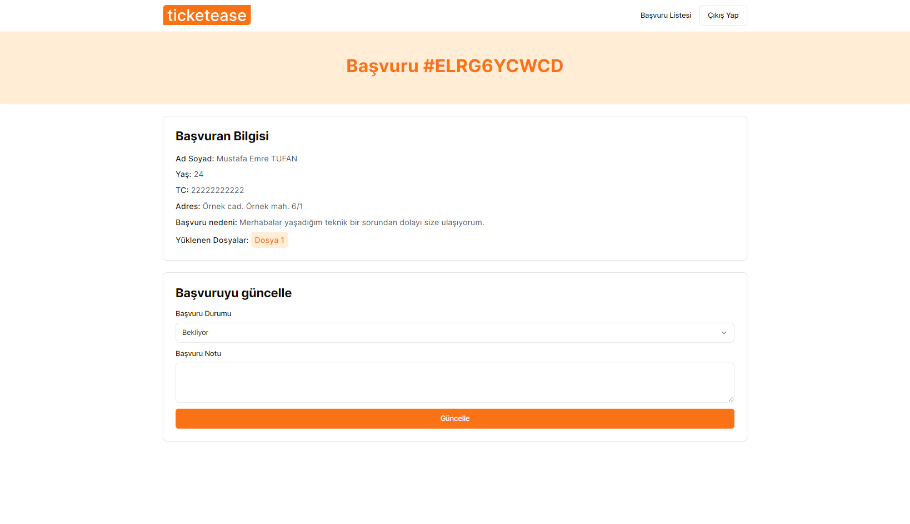
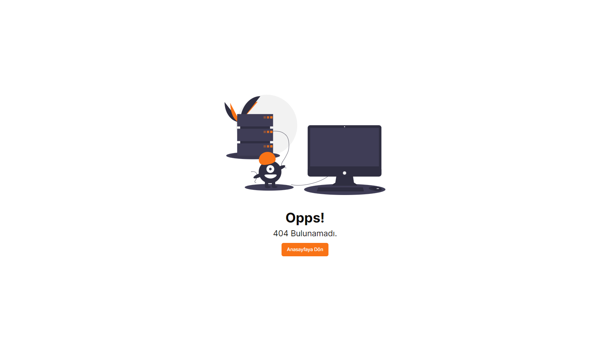

As the final project of the **Fimple React Bootcamp** in collaboration with Patika.dev and Fimple, I developed an application called **ticketease**, which is an **Application/Ticket Management system**. The application is generally about making an application, tracking the relevant application and resolving this application.

## ⚙️ Installation and Setup

Before you start, make sure that Node.js and yarn are installed on your system.

Follow these steps to install and run the project on your local machine:

1. Clone the repository to your local machine using the command:

```bash
git clone https://github.com/emretfn/patika-fimple-final-case.git
```

2. Navigate into the project directory:

```bash
cd patika-fimple-final-case
```

3. Install the project dependencies using npm (make sure you have Node.js and yarn are installed on your machine):

```bash
yarn install
```

4. Start the development server:

```bash
yarn dev
```

The application should now be running on http://localhost:3000.

Please note that you **must** setup a `.env.local` file in the root of the project with your environment variables. Specifically, you need to provide the API URL. You can use `https://api.ticketease.emretufan.dev/` for this purpose. Refer to the `.env.example` file in the root of the project for the necessary environment variables.

## 💻 Technologies and Libraries

👉 React.js <br/>
👉 Typescript <br/>
👉 ESlint <br/>
👉 Commitlint <br/>
👉 Husky <br/>
👉 React Redux <br/>
👉 Redux Toolkit <br/>
👉 Axios <br/>
👉 React Hook Form <br/>
👉 Yup <br/>
👉 React Router DOM <br/>
👉 Sonner <br/>
👉 Radix UI Primitives <br/>
👉 Module CSS <br/>

## Screenshots



---



---



---



---



---



---



---



---


